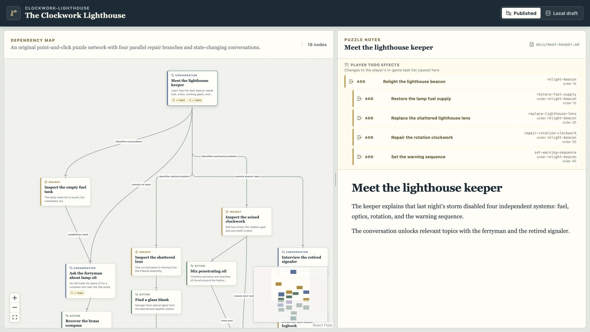

# Puzzle Dependency Chart Editor

When I have time, I work on design for my own point-and-click adventure game. Historically, I used Google Drawings to create the [puzzle dependency chart](https://grumpygamer.com/puzzle_dependency_charts/), but over time, I realized I wanted a custom tool that made it easier to author and browse both the graph and the puzzle details in one place.

You can play with the demo directly at <https://bolinfest.github.io/puzzle-dependency-chart/>.

Here's the idea:

- You start by using a drag-and-drop chart builder on the left where nodes in the graph represent puzzles (though custom nodes are also supported).
- When you click on a node, it brings up a Markdown document on the right where you can document the puzzle in more detail.
- By default, you can use the WYSIWIG Markdown editor, but you can also switch over to "raw mode" to edit the Markdown directly.
- Adventure games with an in-game TODO list like [Return to Monkey Island](https://returntomonkeyisland.com/) or [Thimbleweed Park](https://thimbleweedpark.com/) have actions that result in modifying the TODO list. These modifications are recorded as metadata on the nodes.
- Other types of node metadata can also be recorded, such as whether the design is "TBD" to make it easier to see which puzzles still need work/are placeholders.

A key design principle is that the files that back the tool are plaintext/source-control friendly. The puzzle docs are Markdown while the graph data is in JSON/YAML.

The code for this project is written by [Codex](https://github.com/openai/codex).
